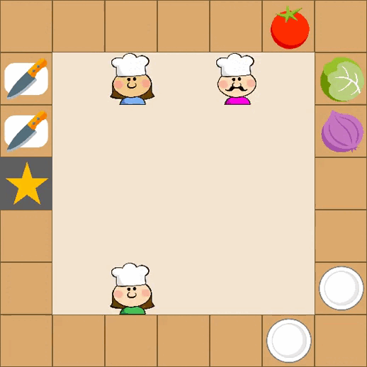
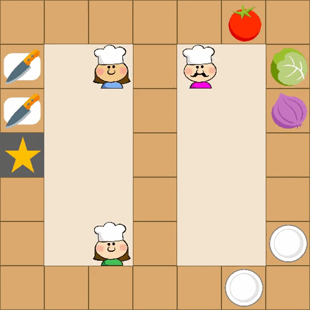
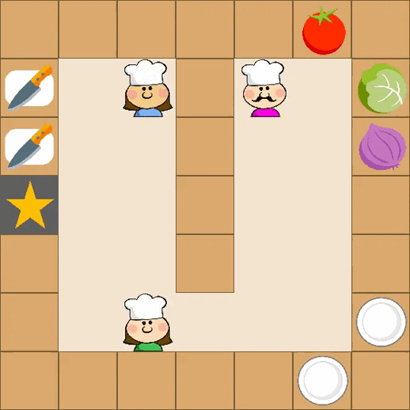
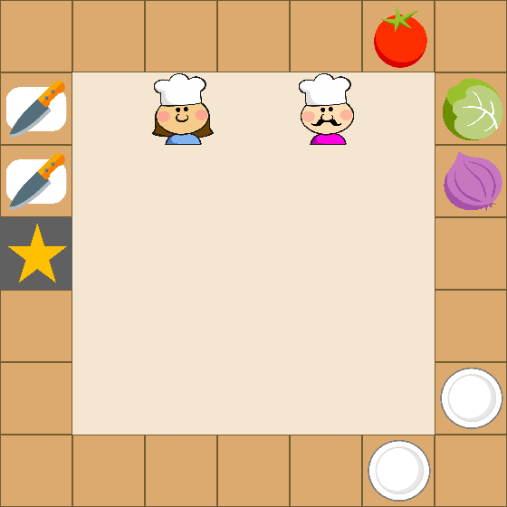
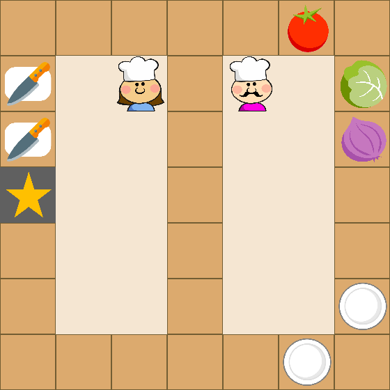
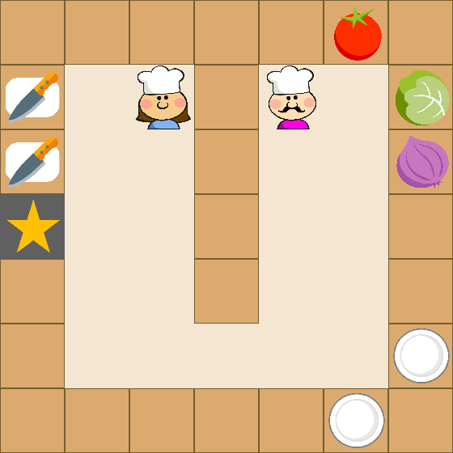

# [ICML 2025] M3HF: Multi-agent Reinforcement Learning from Multi-phase Human Feedback of Mixed Quality

<p align="center">
    </img>
    </img>
    </img>
</p>

[](LICENSE)
[](https://www.python.org/downloads/release/python-380/)
[](https://arxiv.org/abs/2503.02077)


This repository contains the implementation of **M3HF** (Multi-agent Reinforcement Learning from Multi-phase Human Feedback of Mixed Quality), a novel framework that integrates multi-phase human feedback of mixed quality into multi-agent reinforcement learning (MARL) training processes.


## 🔍 Overview

M3HF addresses the significant challenge of designing effective reward functions in multi-agent reinforcement learning by incorporating human feedback of varying quality levels. The framework enables:

- **Multi-phase feedback integration** across training generations
- **Mixed-quality feedback handling** from both expert and non-expert humans  
- **LLM-powered feedback parsing** for natural language instructions
- **Adaptive reward shaping** through predefined templates
- **Robust learning** with performance-based weight adjustments


## 🚀 Installation

### Prerequisites

- Python 3.8 or higher
- CUDA-capable GPU (recommended)
- OpenAI API key (optional, for LLM integration)

### Quick Installation

```bash
git clone https://github.com/your-username/gym-macro-overcooked.git
cd gym-macro-overcooked

# Install system dependencies (Ubuntu/Debian)
sudo apt-get update
sudo apt-get install libsdl2-dev

# Install Python dependencies
pip install -e .
```

### Dependencies

The package automatically installs all required dependencies:

- **Core ML**: `torch`, `ray[rllib]`, `gymnasium`
- **Environment**: `pygame`, `numpy`, `matplotlib`
- **Logging**: `wandb`, `tensorboard`
- **LLM Integration**: `openai` (optional)

## ⚡ Quick Start

### 1. Manual Environment Testing

```bash
# Play the environment manually
python play.py --env_id Overcooked-MA-v1 --n_agent 3 --task 6 --map_type A
```

### 2. M3HF Training Options

**Two main scripts are available:**
- `m3hf.py`: Full M3HF algorithm with human feedback integration and multi-generation training
- `m3hf_main.py`: Simplified training script for basic multi-agent PPO without feedback loop

```bash
# Run M3HF with simulated human feedback
python m3hf.py \
    --env_id Overcooked-MA-v1 \
    --n_agent 3 \
    --map_type A \
    --task 6 \
    --generations 5 \
    --use_wandb \
    --demo_mode

# Run with OpenAI integration for real human feedback
export OPENAI_API_KEY="your-api-key"
python m3hf.py \
    --env_id Overcooked-MA-v1 \
    --n_agent 3 \
    --map_type A \
    --task 6 \
    --generations 5 \
    --use_wandb

# Alternative: Simple training without feedback loop
python m3hf_main.py \
    --env_id Overcooked-MA-v1 \
    --num_workers 4 \
    --training_iterations 100
```

### 3. GPU Optimization

**For faster training with multiple GPUs:**

```bash
# Custom GPU selection
python m3hf.py \
    --env_id Overcooked-MA-v1 \
    --n_agent 3 \
    --map_type A \
    --task 6 \
    --generations 5 \
    --num_gpus 2 \
    --gpu_devices "0,2" \
    --use_wandb \
    --demo_mode
```


### 4. Baseline Comparison

```bash
# Train IPPO baseline
python play_rllib_ippo.py \
    --env_id Overcooked-MA-v1 \
    --num_workers 4 \
    --training_iterations 1000
```

## 🧠 M3HF Algorithm

### Algorithm Overview

M3HF operates through iterative generations of agent training and human feedback:

1. **Agent Training**: Multi-agent policies trained with current reward functions
2. **Rollout Generation**: Video demonstrations of agent behavior
3. **Human Feedback**: Natural language feedback on agent performance
4. **LLM Parsing**: Feedback converted to structured instructions
5. **Reward Shaping**: New reward functions generated from templates
6. **Weight Update**: Performance-based adjustment of reward weights

### Core Components

- **Multi-phase Human Feedback Markov Game (MHF-MG)**: Theoretical framework
- **Feedback Quality Assessment**: Automatic filtering of low-quality feedback
- **Reward Function Templates**: Distance, action, state, and cooperation-based rewards
- **Meta-learning Weight Updates**: Adaptive optimization of reward combinations
- **Robustness Mechanisms**: Handling of mixed-quality and contradictory feedback

## 🎮 Environment Details

### Overcooked Multi-Agent Environment

The environment simulates a cooperative cooking task where 3 agents must prepare salads:

| Map A | Map B | Map C |
|:---:|:---:|:---:|
|</img> | </img> | </img> |

### Task Types

```python
TASKLIST = [
    "tomato salad",           # task 0
    "lettuce salad",          # task 1  
    "onion salad",            # task 2
    "lettuce-tomato salad",   # task 3
    "onion-tomato salad",     # task 4
    "lettuce-onion salad",    # task 5
    "lettuce-onion-tomato salad"  # task 6 (most complex)
]
```

### Observation Space

**Vector Observation** (32-dimensional):
```python
obs = [
    tomato.x, tomato.y, tomato.status,      # [0:3]
    lettuce.x, lettuce.y, lettuce.status,   # [3:6]  
    onion.x, onion.y, onion.status,         # [6:9]
    plate1.x, plate1.y,                     # [9:11]
    plate2.x, plate2.y,                     # [11:13]
    knife1.x, knife1.y,                     # [13:15]
    knife2.x, knife2.y,                     # [15:17]
    delivery.x, delivery.y,                 # [17:19]
    agent1.x, agent1.y,                     # [19:21]
    agent2.x, agent2.y,                     # [21:23]
    agent3.x, agent3.y,                     # [23:25]
    task_onehot                             # [25:32]
]
```

### Action Space

**Macro Actions**:
- Navigation: `get_tomato`, `get_lettuce`, `get_onion`
- Interaction: `get_plate1`, `get_plate2`, `chop`, `deliver`
- Movement: `go_knife1`, `go_knife2`, `go_counter`
- Basic: `stay`, `up`, `down`, `left`, `right`

## 📚 Usage Examples

### Human Feedback Examples

```python
# Example feedback for coordination improvement
feedback = "The red chef should get the tomato first, then the green chef can take it and cut it as quickly as possible."

# Example feedback for task efficiency  
feedback = "Agents should work in parallel - one chopping while another gets plates."

# Example feedback for error correction
feedback = "Don't deliver wrong salads! Make sure all ingredients are properly chopped and combined."
```

### Custom Reward Templates

```python
from language import RewardFunctionGenerator

# Distance-based reward template
def distance_reward(obs, target_agent_idx, target_item_idx):
    agent_pos = obs[target_agent_idx*2:(target_agent_idx*2+2)]
    item_pos = obs[target_item_idx*2:(target_item_idx*2+2)]
    return -np.linalg.norm(agent_pos - item_pos)

# Action-based reward template  
def action_reward(obs, action, target_action):
    return 1.0 if action == target_action else 0.0

# Cooperation reward template
def cooperation_reward(obs, agent1_idx, agent2_idx, distance_threshold=2.0):
    agent1_pos = obs[agent1_idx*2:(agent1_idx*2+2)]
    agent2_pos = obs[agent2_idx*2:(agent2_idx*2+2)]
    distance = np.linalg.norm(agent1_pos - agent2_pos)
    return 1.0 if distance <= distance_threshold else 0.0
```


## 🐛 Troubleshooting

### Common Issues

1. **OpenAI API Errors**:
   ```bash
   export OPENAI_API_KEY="your-key-here"
   # Or disable LLM: python m3hf_main.py --no_openai
   ```

2. **Ray/RLLib Issues**:
   ```bash
   pip install ray[rllib]==2.0.0
   # Check Ray version compatibility
   ```

3. **SDL Dependencies**:
   ```bash
   sudo apt-get install libsdl2-dev libsdl2-image-dev libsdl2-mixer-dev
   ```

4. **CUDA/GPU Issues**:
   ```bash
   # Check CUDA installation and GPU availability
   nvidia-smi
   
   # Use CPU-only mode
   python m3hf.py --num_gpus 0
   
   # Select specific GPUs to avoid conflicts
   python m3hf.py --gpu_devices "0,2" --num_gpus 2
   
   # Check GPU memory usage and free up memory if needed
   nvidia-smi --query-gpu=memory.used,memory.total --format=csv
   ```

5. **GPU Memory Issues**:
   ```bash
   # Reduce batch sizes if running out of memory
   # Edit m3hf.py and reduce train_batch_size and sgd_minibatch_size
   
   # Or use fewer workers
   python m3hf.py --num_workers 2 --workers_per_cpu 1
   
   # Monitor GPU usage during training
   watch -n 1 nvidia-smi
   ```

### Performance Optimization

- **Multi-GPU Training**: 
  ```bash
  # Use specific GPUs for optimal performance
  python m3hf.py --num_gpus 2 --gpu_devices "0,2"
  ```
- **Parallel Workers**: 
  ```bash
  # Increase workers based on CPU cores (recommended: CPU_cores / 2)
  python m3hf.py --num_workers 8 --workers_per_cpu 2
  ```
- **Memory Usage**: 
  ```bash
  # Monitor memory and adjust if needed
  # Batch sizes are auto-optimized for multi-GPU setups
  # Default: train_batch_size=20480, sgd_minibatch_size=2048
  ```
- **Hardware Recommendations**:
  - **Minimum**: 1 GPU, 8 CPU cores, 16GB RAM
  - **Recommended**: 2+ GPUs, 16+ CPU cores, 32GB+ RAM
  - **Optimal**: 3+ GPUs (A30/V100/A100), 32+ CPU cores, 64GB+ RAM
- **Wandb Logging**: Enable for tracking: `--use_wandb`

## 📄 Citation

If you use this code in your research, please cite:

```bibtex
@article{wang2025m3hf,
  title={M3HF: Multi-agent Reinforcement Learning from Multi-phase Human Feedback of Mixed Quality},
  author={Wang, Ziyan and Zhang, Zhicheng and Fang, Fei and Du, Yali},
  journal={Proceedings of the 42nd International Conference on Machine Learning},
  year={2025}
}
```
